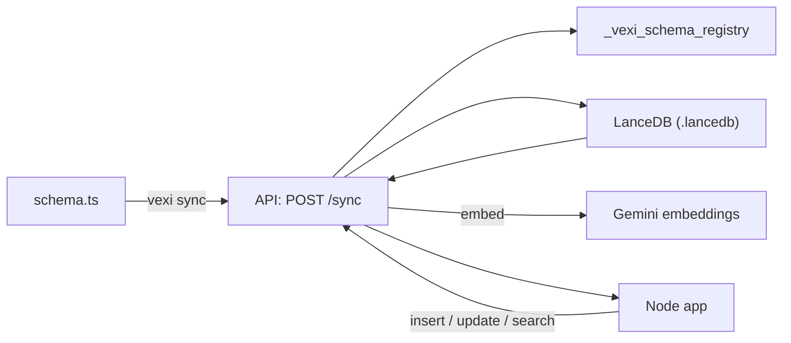

# Vexi

[](https://github.com/marcoshernanz/vexi/actions/workflows/ci.yml)

Vexi is a local-first RAG database you drive from TypeScript.

- Define tables in `schema.ts` with a small Zod-like DSL.
- Run `vexi sync` to apply additive migrations and register the schema.
- Use a fully type-safe client (`insert`, `update`, `search`) while the Rust API handles storage (LanceDB) and embeddings (Gemini).

Highlights:

- Type-safe `db.<table>.insert/update/search` derived from your schema.
- Server-side validation (schema registry is the contract; no inference on write).
- Automatic embeddings on write and query (Gemini v1).
- Additive-only migrations + explicit `reindex` for embedding changes.
- Chunking strategy support (`recursive-markdown`) for long-form text.

Why this exists:

- RAG apps often accumulate glue code: schema drift, ad-hoc migrations, hand-rolled embedding pipelines.
- Vexi makes schema + validation + embeddings a single contract you can `sync` and then rely on.

This repo is a monorepo:

- `sdk/` TypeScript SDK + `vexi` CLI
- `api/` Rust HTTP API (Axum) + LanceDB
- `example-app/` minimal consumer

## How It Works



## Design Constraints (v1)

- Schema registry is the contract (server validates writes; no schema inference).
- Migrations are additive-only.
- Embeddings provider is Gemini only.
- No backward compatibility (v1-only endpoints + CLI).

## Quickstart (run the demo)

Prereqs: Node.js 18+ and Rust.

Terminal A (API):

```bash
cd sdk
npm ci
npm run build

cd ../api
cp .env.example .env
# set GEMINI_API_KEY in api/.env
cargo run
```

Terminal B (client + schema sync):

```bash
cd example-app
npm ci
npm run sync
npm run start
```

Notes:

- `GEMINI_API_KEY` is required for embeddings/search/reindex (the API can start without it, but search will fail).
- If you see a vector dimension error, set `VEXI_VECTOR_DIM` (default `768`).

## Schema + Client (what usage looks like)

`schema.ts`

```ts
import { createTable, v } from "vexi";

export const users = createTable({
  name: v.string().embed(),
  bio: v.optional(v.string().embed({ strategy: "recursive-markdown" })),
  isActive: v.boolean(),
});
```

`main.ts` (NodeNext/ESM: note the `.js` extension on local imports)

```ts
import { createClient } from "vexi";
import { users } from "./schema.js";

const db = createClient({
  schema: { users },
  config: { baseUrl: "http://localhost:3000" },
});

const inserted = await db.users.insert({ name: "Alice", isActive: true });
await db.users.update(inserted.id, { isActive: false });

const results = await db.users.search("Alice", { topK: 5 });
console.log(results);
```

## CLI

Sync schema (one-shot):

```bash
npx vexi sync --schema ./schema.ts --url http://localhost:3000
```

Reindex (backfill vectors after changing embedding config/model/strategy):

```bash
npx vexi reindex users --url http://localhost:3000
```

## Docs

- `PROJECT.md` (product + API philosophy)
- `STATUS.md` (what v1 does today)

## HTTP API (v1)

- `GET /health`
- `POST /sync`
- `POST /tables/{name}/insert`
- `PATCH /tables/{name}/{id}`
- `POST /tables/{name}/search`
- `POST /tables/{name}/reindex`

Error shape (all non-2xx):

```json
{ "error": { "code": "...", "message": "...", "details": {} } }
```

Insert response shape:

```json
{ "ok": true, "rows": [{ "id": "...", "...": "..." }] }
```

Search response shape:

```json
{ "ok": true, "results": [{ "score": 0.123, "item": { "id": "..." } }] }
```

## Configuration

API env vars:

- `GEMINI_API_KEY` (required for embeddings/search/reindex)
- `VEXI_VECTOR_DIM` (default `768`)
- `LANCEDB_URI` (default `.lancedb`)
- `VEXI_DEBUG=1` (enables `GET /registry`)

## Limitations (intentional for v1)

- No auth / multi-tenant model.
- No destructive migrations (type changes, column removal).
- Local-first (LanceDB on disk).

## Development

```bash
cd sdk && npm run lint && npm run build
cd api && cargo fmt && cargo clippy -- -D warnings
```
